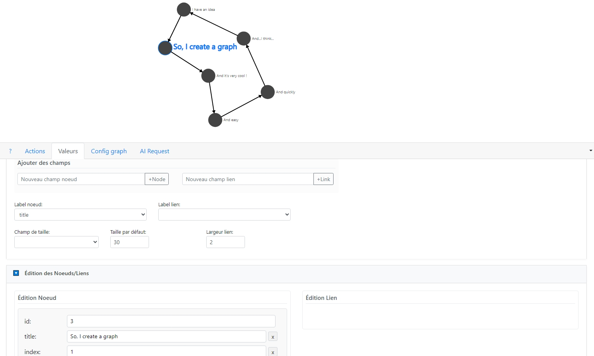

# 📊 Graph Creator (v0.1)

🇬🇧 [English Version](README.md)

**Graph Creator** est un outil interactif de création et édition de graphes orientés qui permet de visualiser et manipuler facilement des réseaux de nœuds et de liens. Cet outil basé sur D3.js offre une interface intuitive pour construire des graphes complexes, les configurer visuellement et les exporter.

🚀 Introduction

Graph Creator v0.1 est une application web qui permet de créer, visualiser et manipuler des graphes directement dans le navigateur. Grâce à des fonctionnalités d'édition intuitives et une interface utilisateur moderne, l'outil est adapté aussi bien pour la conception de diagrammes simples que pour la représentation de réseaux complexes.

## ✨ Fonctionnalités principales (v0.1)

### 🔵 Gestion des nœuds et liens

- ➕ Création de nœuds par double-clic sur le canevas
- 🔗 Création de liens entre nœuds (avec Ctrl+clic)
- 🔄 Support pour les auto-liens (boucles)
- 🗑️ Suppression de nœuds et liens (touche Suppr)
- 🖱️ Déplacement des nœuds par glisser-déposer

### 🎨 Personnalisation de l'apparence

- 📐 Configuration des propriétés visuelles (taille des nœuds, épaisseur des liens)
- ↔️ Choix entre liens droits et liens courbés
- 📈 Ajustement de la courbure des liens et des boucles
- 📍 Plusieurs options de disposition (cercle, grille, aléatoire)

### 📝 Édition des données

- 🏷️ Ajout de champs personnalisés pour les nœuds et les liens
- ✏️ Édition directe des propriétés dans un formulaire
- 🔤 Choix des champs à utiliser pour les libellés et les tailles

### 🛠️ Autres outils

- ⏪ Historique complet avec annulation/rétablissement (Undo/Redo)
- 🔍 Zoom et déplacement du graphe
- 💾 Import/Export au format JSON
- 🧠 Génération de graphes via un modèle d'IA (Ollama)

## 🖥️ Interface utilisateur

L'interface est organisée en quatre onglets principaux :

### ❓ Aide (?)

- 📖 Guide des raccourcis clavier et des actions principales

### ⚙️ Actions

- ↩️ Boutons Undo/Redo
- 📜 Historique des actions

### 📊 Valeurs

- 📤 Import/Export de graphes
- ⚙️ Paramétrage des champs à afficher
- 📋 Formulaires d'édition des nœuds et liens
- 🏷️ Gestion des champs personnalisés

### 🔧 Config Graph

- 🧭 Sélection et rechargement de layouts (Circle, Grid, Random)
- 🔗 Configuration du style des liens
- 🧲 Paramètres des forces de simulation physique

### 🤖 AI Request

- ✨ Génération de graphes par description textuelle
- 💡 Proposition d'ajouts au graphe existant
- 🧠 Utilisation de modèles locaux via Ollama

## 🚀 Utilisation rapide

- ➕ **Créer un nœud** : Double-cliquez sur une zone vide
- 🔗 **Créer un lien** : Sélectionnez un nœud, puis Ctrl+Cliquez sur un autre nœud
- 🔄 **Créer un lien avec nouveau nœud** : Sélectionnez un nœud, puis Ctrl+Cliquez sur une zone vide
- 🗑️ **Supprimer** : Sélectionnez un élément et appuyez sur Delete ou Backspace
- 📍 **Appliquer un layout** : Sélectionnez un type de disposition et cliquez sur "Recharger"

## ⚡ Installation et démarrage

1. 📥 Clonez le dépôt
2. 🌐 Lancez un serveur web local (par exemple avec `python -m http.server`)
3. 🌎 Ouvrez l'application dans votre navigateur

Pour les fonctionnalités d'IA, assurez-vous que [Ollama](https://github.com/ollama/ollama) est installé et exécuté localement.

## 💻 Technologies utilisées

- 📊 **D3.js v6** : Visualisation de données et simulation physique
- 🔧 **JavaScript (ES6+)** : Logique applicative
- 🎨 **Bootstrap 4** : Interface utilisateur responsive
- 🧠 **Ollama API** : Intégration avec des modèles de langage pour la génération de graphes

## 🔮 Développement futur

Ce projet est en développement actif. Les fonctionnalités prévues pour les prochaines versions incluent :

- 🎭 Styles personnalisés pour les nœuds (couleurs, formes)
- 🖼️ Export vers différents formats (SVG, PNG)
- 🔍 Filtres et recherche dans les grands graphes
- 📈 Analyses et métriques sur les graphes
- ... et des millers d'autres fonctionnalités.
